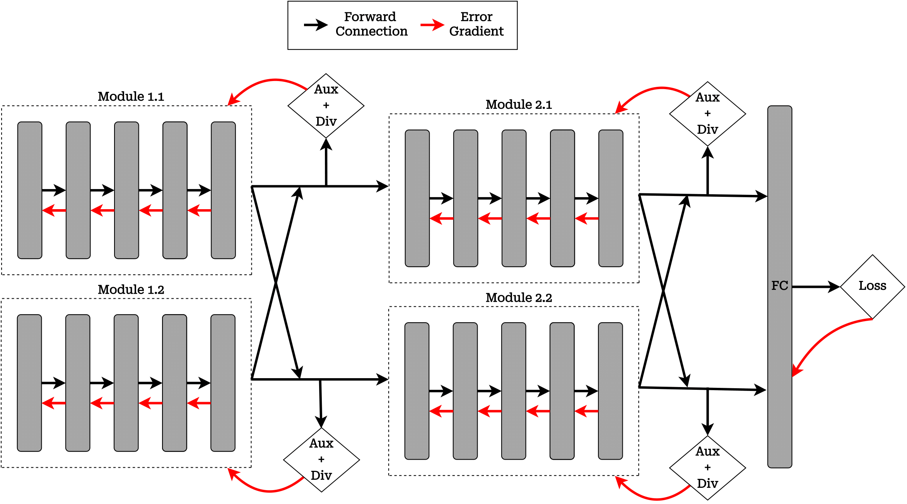
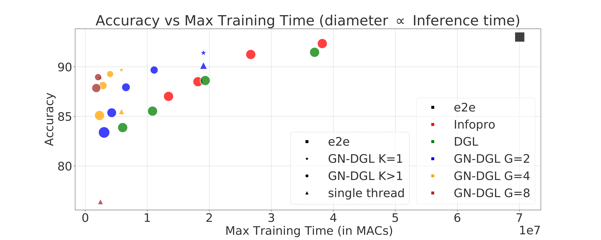
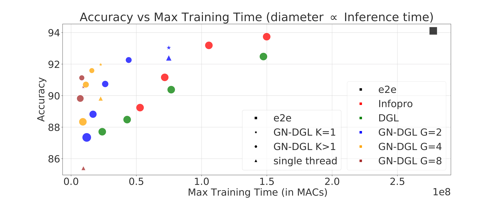
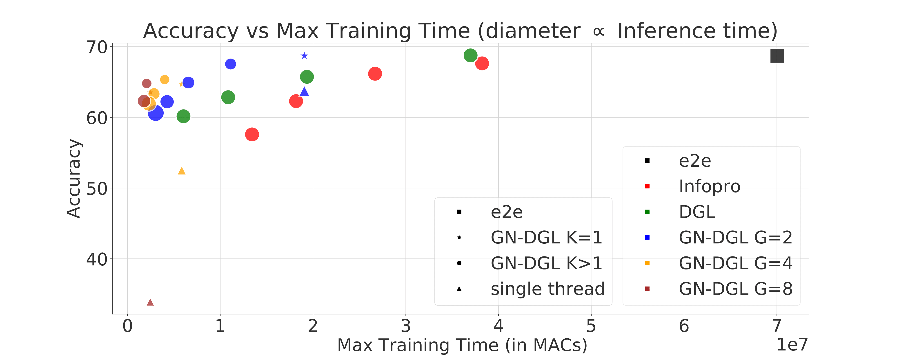
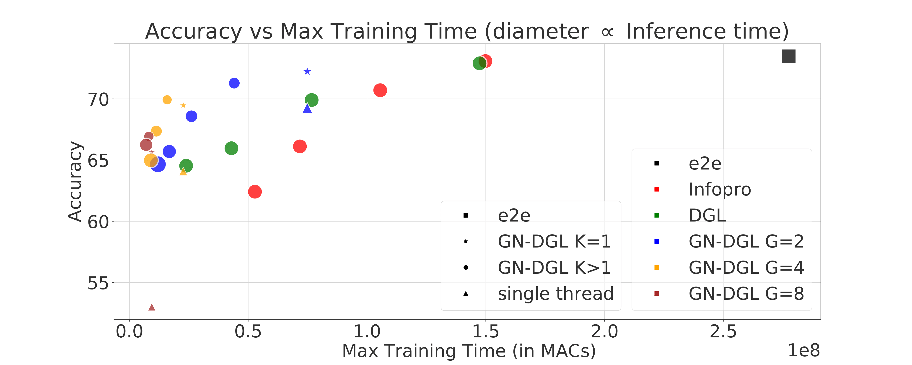
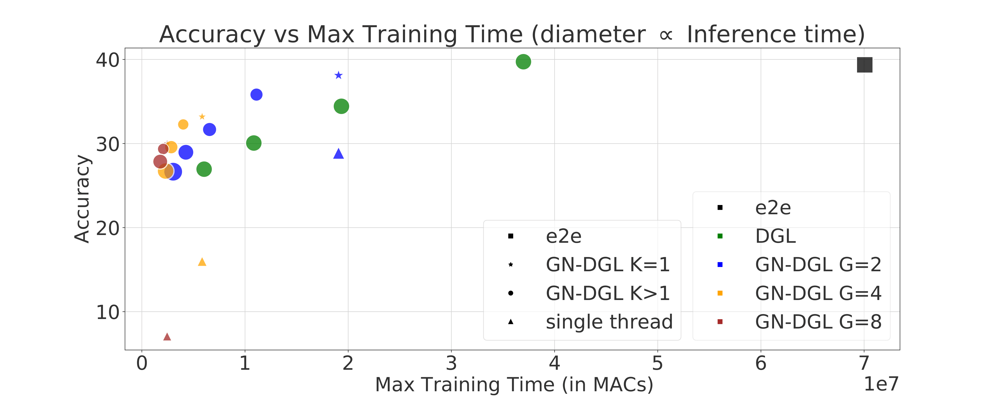
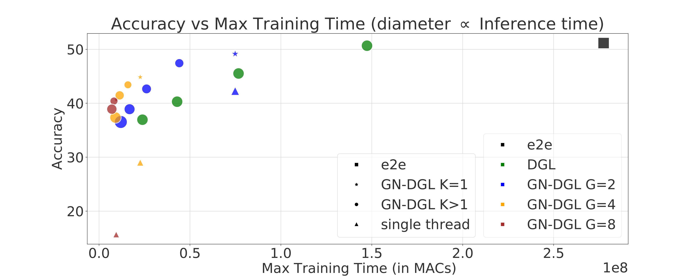

## Local Learning with Neuron Groups
This repository contains the code to reproduce the results presented in the paper [Local Learning with Neuron Groups](https://arxiv.org/abs/2301.07635).



## Citation
If you find the code useful, please cite our paper.
```
@Article{patel2023local,
  author  = {Adeetya Patel, Michael Eickenberg and Eugene Belilovsky},
  journal = {arXiv:2301.07635},
  title   = {Local Learning with Neuron Groups},
  year    = {2023},
}
```
## Get Started

1. The [Multilayer-GN-DGL](Multilayer_GN_DGL) folder contains the code to reproduce the results of GN-DGL for different values of K and G. The end-to-end and DGL are considered as a special case of G=1 and can be reproduced using the same folder.
   ```bash
   # ResNet-32:
   python train.py --dataset $dataset_name --model resnet --layers 32 --droprate 0.0 --cos_lr  --local_module_num $K --groups $G --local_loss_mode cross_entropy --aux_net_widen 1 --wide-list 16,16,32,64 --aux_net_feature_dim 128 --aux_net_config 1c2f --detach --detach-ratio 1.0 --div-reg --div-temp 3.0 --div-weight 0.5 --eval-ensemble --ensemble-type layerwise
    
   # ResNet-32x2:
   python train.py --dataset $dataset_name --model resnet --layers 32 --droprate 0.0 --cos_lr  --local_module_num $K --groups $G --local_loss_mode cross_entropy --aux_net_widen 1 --wide-list 32,32,64,128 --aux_net_feature_dim 128 --aux_net_config 1c2f --detach --detach-ratio 1.0 --div-reg --div-temp 3.0 --div-weight 0.5 --eval-ensemble --ensemble-type layerwise
   ```
    
   All the other commands are presented in [commands\.sh](Multilayer_GN_DGL/commands.sh)

2. The [single_thread](single_thread) folder contains the code for reproducing the single thread results for different values of G, denoted by triangle in the following figures.
   
   ```bash
   # ResNet-32:
   python train.py --dataset $dataset_name --model resnet --layers 32 --droprate 0.0 --cos_lr --local_module_num 1A  --groups $G --local_loss_mode cross_entropy --aux_net_widen 1 --wide-list 16,16,32,64 --aux_net_feature_dim 128 --aux_net_config 1c2f --eval-ensemble --ensemble-type layerwise
    
   # ResNet-32x2:
   python train.py --dataset $dataset_name --model resnet --layers 32 --droprate 0.0 --cos_lr --local_module_num 1A  --groups $G --local_loss_mode cross_entropy --aux_net_widen 1 --wide-list 32,32,64,128 --aux_net_feature_dim 128 --aux_net_config 1c2f --eval-ensemble --ensemble-type layerwise
   ```
    
   All the other commands are presented in [commands\.sh](single_thread/commands.sh)

## Results
| |ResNet-32|ResNet-32 x 2|
| :---: | :---: | :---: |
| CIFAR-10 | |  |
| CIFAR-100 | |  |
| ImageNet-32| |  |

Results on CIFAR-10 (top row), CIFAR-100 (middle row), imagenet32 (bottom row). We show Accuracy versus max. training time
in MACs for a given node in a distributed scenario for various local learning methods. We observe that for both ResNet-32 (left) and a wider
ResNet-32x2 (right), the GN-DGL leads to better tradeoffs in training time versus accuracy. The size of the bubbles is proportional to the
inference time of the models.

## Contact
If you have any questions, please do not hesitate to reach out to the authors. 
<br><br>Adeetya Patel: adeetyapatel12@gmail.com.

## Acknowledgments
We would like to acknowledge that parts of the code were reused from the project [InfoPro](https://github.com/blackfeather-wang/InfoPro-Pytorch).
